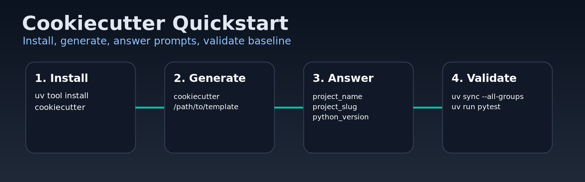

# ai-sdlc-python-template

A Cookiecutter template for Python applications and libraries built with a controlled, approval-gated, AI-assisted SDLC workflow.


## Why this template

This template helps teams start Python projects with:

- a reproducible repository layout;
- built-in quality tooling;
- skill-driven SDLC stages;
- human approval gates between workflow stages.

## Quick start

### 1) Install Cookiecutter

Choose one option:

```bash
uv tool install cookiecutter
```

```bash
pipx install cookiecutter
```

```bash
python -m pip install cookiecutter
```

### 2) Generate a project

Local path:

```bash
cookiecutter /path/to/ai-sdlc-python-template
```

Git URL:

```bash
cookiecutter https://github.com/<org>/ai-sdlc-python-template.git
```

### 3) Run initial checks

```bash
cd <your-project-slug>
uv sync --all-groups
uv run pre-commit install
uv run pytest
```



## Cookiecutter basics for first-time users

Cookiecutter asks for values from `cookiecutter.json` and generates a new repository using those answers.

Useful commands:

Use defaults without prompts:

```bash
cookiecutter /path/to/ai-sdlc-python-template --no-input
```

Pass values directly:

```bash
cookiecutter /path/to/ai-sdlc-python-template \
  --no-input \
  project_name="My Service" \
  project_slug="my-service" \
  python_version="3.12"
```

Replay previous answers:

```bash
cookiecutter /path/to/ai-sdlc-python-template --replay
```

## What you get

- `src/` package layout with Hatchling;
- `uv`, pytest, pytest-bdd, Ruff, mypy, coverage, and pre-commit configuration;
- reusable AI skills under `.agents/skills/`;
- staged SDLC documentation under `sdlc_docs/`;
- workflow traceability and approval-gated transitions;
- documentation placeholders for MkDocs or Zensical;
- issue and change-request templates.


## SDLC navigation in generated projects

Start here after generation:

1. `sdlc_docs/trace_workflow.md`
2. `sdlc_docs/00_inception/sources/`
3. `WORKFLOW.md`

The skill chain in `.agents/skills/` drives stage transitions from inception through release preparation.

## Troubleshooting

- `cookiecutter: command not found`: reopen your shell, or run with `uvx cookiecutter`.
- Destination folder already exists: choose another output folder, or remove the old generated repository.
- Wrong prompt values: re-run with `--replay` or pass explicit key-value arguments.

## Template scope

This template provides reusable process and infrastructure. Project-specific requirements, architecture, code, datasets, and exercises are added after generation.
