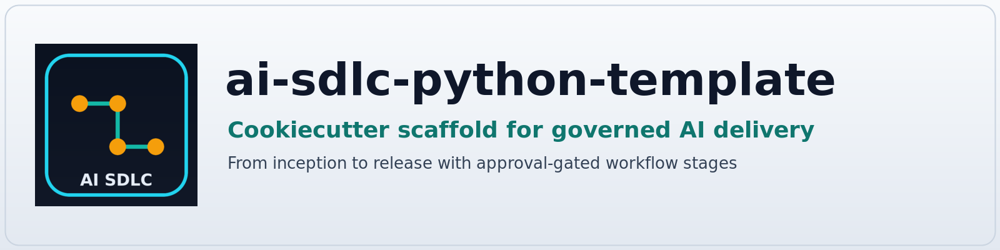
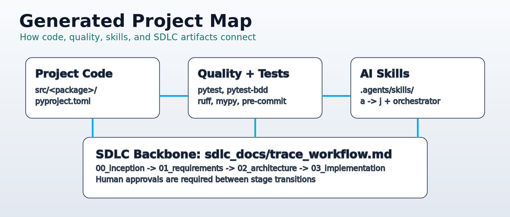

# AI SDLC - Python template

A Cookiecutter template for Python applications and libraries built with a controlled, approval-gated, AI-assisted Software Development Life Cycle workflow.

## Why this template

This template helps teams start Python projects with:

- a reproducible repository layout;
- built-in quality tooling;
- skill-driven SDLC stages;
- human approval gates between workflow stages;
- centrally maintained Agent Skills that can be updated independently of the template.

## Requirements

Before generating a project, install:

- Python;
- Cookiecutter;
- Node.js and npm.

Node.js/npm are required because the template installs the AI SDLC Agent Skills during project creation with the `skills` CLI through `npx`.

Verify that `npx` is available:

```bash
npx --version
```

If `npx` is not available, install a current Node.js release using your operating system package manager or the official Node.js distribution.

## Quick start

### 1) Install Cookiecutter

Choose one option:

```bash
uv tool install cookiecutter
```

```bash
pipx install cookiecutter
```

```bash
python -m pip install cookiecutter
```

### 2) Verify `npx`

```bash
npx --version
```

### 3) Generate a project

```bash
cookiecutter https://github.com/ecarrenolozano/ai-assisted-python-template.git
```

During project generation, the template downloads the AI SDLC skills from:

```text
https://github.com/ecarrenolozano/ai-sdlc-skills
```

The skills are installed with:

```bash
npx skills add ecarrenolozano/ai-sdlc-skills --all
```

### 4) Run initial checks

```bash
cd <your-project-slug>
uv sync --all-groups
uv run pre-commit install
uv run pytest
```

## Cookiecutter basics for first-time users

Cookiecutter asks for prompt values and generates a new repository from this template.

Run with prompts:

```bash
cookiecutter https://github.com/ecarrenolozano/ai-assisted-python-template.git
```

Reuse previous answers:

```bash
cookiecutter https://github.com/ecarrenolozano/ai-assisted-python-template.git --replay
```

## What you get

- `src/` package layout with Hatchling;
- `uv`, pytest, pytest-bdd, Ruff, mypy, coverage, and pre-commit configuration;
- reusable AI SDLC Agent Skills installed during project creation;
- a provider-neutral canonical skills location under `.agents/skills/`;
- compatibility with supported AI coding agents through the `skills` CLI;
- staged SDLC documentation under `sdlc_docs/`;
- workflow traceability and approval-gated transitions;
- documentation placeholders for MkDocs or Zensical;
- issue and change-request templates.

The Agent Skills are maintained separately from this Cookiecutter template in the [`ai-sdlc-skills`](https://github.com/ecarrenolozano/ai-sdlc-skills) repository. This allows existing generated projects to receive newer versions of the workflow without regenerating the project.



## Updating Agent Skills

Generated projects can update their installed skills independently of the Cookiecutter template.

From the root of a generated project, run:

```bash
npx skills update
```

You do not need to regenerate the project to receive skill updates.

## SDLC navigation in generated projects

Start here after generation:

1. `sdlc_docs/trace_workflow.md`
2. `sdlc_docs/00_inception/sources/`
3. `WORKFLOW.md`

The Agent Skills under `.agents/skills/` drive stage transitions from inception through release preparation.

## Troubleshooting

- `cookiecutter: command not found`: reopen your shell, or run with `uvx cookiecutter`.
- `npx: command not found`: install Node.js/npm and verify with `npx --version`.
- Skill installation fails during project generation: verify internet access and run `npx skills add ecarrenolozano/ai-sdlc-skills --all` from the generated project directory.
- Destination folder already exists: choose another output folder, or remove the old generated repository.
- Wrong prompt values: re-run with `--replay` or pass explicit key-value arguments.

## Template scope

This template provides reusable process and infrastructure. Project-specific requirements, architecture, code, datasets, and exercises are added after generation.

---

#### Authors

|                    |                                                            |                     |
|--------------------|------------------------------------------------------------|---------------------|
| Edwin Carreño      | [Scientific Software Center](https://www.ssc.uni-heidelberg.de/en)                  | Heidelberg, Germany |
| Maxim Scheremetjew | [Max Plank Institute of Molecular Cell Biology and Genetics](https://www.mpi-cbg.de/) | Dresden, Germany    |
