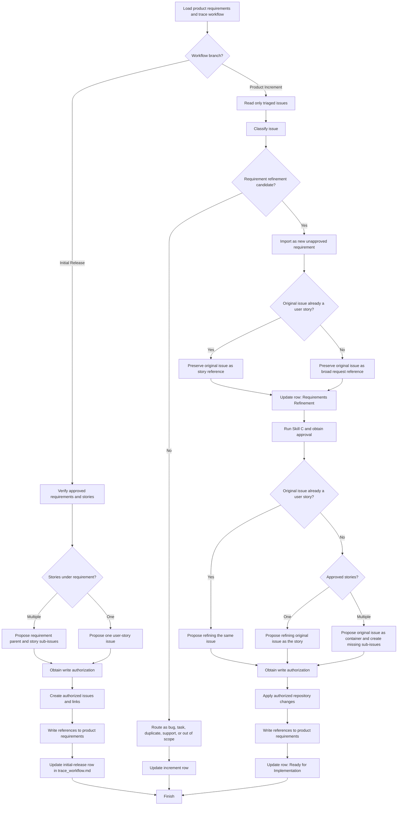

# Process Flowchart

The written workflow and Mermaid flowchart below describe the same branches and decisions. This file documents the skill process; it is not the project traceability artifact.

## Written workflow

1. Load `product_requirements.md` and `trace_workflow.md` when present.
2. Select the workflow branch.
   - Initial release: continue at step 3.
   - Product increment: continue at step 8.

### Initial release

3. Verify that the selected requirements and stories are approved.
4. For each approved requirement, count its user stories.
5. If it has multiple stories, propose one requirement parent issue and one sub-issue per story.
6. If it has one story, propose only one user-story issue unless a parent is explicitly requested.
7. Obtain authorization, create the approved issue structure, write repository references to the requirements document, update the initial-release row in `trace_workflow.md`, and finish.

### Product increment

8. Read only issues that passed triage.
9. Classify each issue.
10. If the issue is not a broad product request or existing user story, route it outside requirement refinement, update `trace_workflow.md`, and finish that issue.
11. Import the issue as a new unapproved requirement in `product_requirements.md`.
12. Determine whether the original issue already represents a user story.
13. If yes, preserve the original issue as the story reference; do not create another issue.
14. If no, preserve the original issue as the broad request reference.
15. Update the increment row to `Requirements Refinement` with next action `Run Skill C`, then stop.
16. After Skill C returns an approved requirement and stories, resume synchronization.
17. If the original issue was already a user story, propose refining the same issue with the approved story and acceptance criteria.
18. If the original issue was broad, count the approved stories.
19. If there is one story, propose refining the original issue as that story without a parent issue.
20. If there are multiple stories, propose reusing the original issue as the requirement container and creating only the missing story sub-issues.
21. Obtain authorization for the proposed remote writes.
22. Apply authorized edits, creations, and parent/sub-issue links.
23. Write repository references to `product_requirements.md`.
24. Update the increment row to `Complete`, current activity `Ready for Implementation`, and next action `Assign or self-assign issue`.

## Mermaid flowchart

